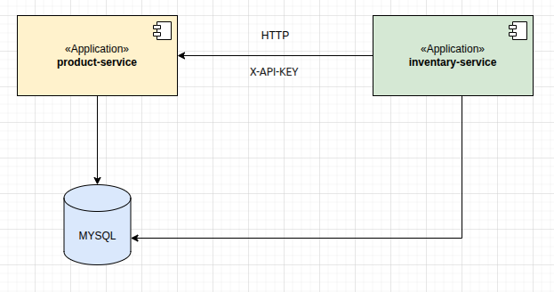

# 🏪 Store App

Este proyecto está compuesto por **dos microservicios**:

```text
| Microservicio         | Descripción                 |
|-----------------------|-----------------------------|
| product-service       | Gestión de productos        |
| inventary-service     | Gestión de inventario       |
```

Ambos están contenidos dentro de un proyecto **multi-módulo Maven** llamado `store`.

---

## 🛠 Tecnologías utilizadas

- **Java** 21  
- **Spring Boot** 3.3.4  
- **Spring Data JPA**  
- **Spring Web**  
- **Spring Cloud** 2023.0.3  
- **Feign Client** para comunicación entre microservicios  
- **MySQL** como base de datos  
- **Lombok** para reducir código *boilerplate*  
- **Spring HATEOAS JSON:API** para hipermedia  
- **SpringDoc OpenAPI** para documentación de API  
- **JUnit 5**, **Mockito**, **Testcontainers**, **WireMock** para pruebas  

---


## 🗺️ Diagrama de Arquitectura



---

## 📂 Estructura del proyecto

```text
store/
├── pom.xml               # POM padre (configuración y dependencias comunes)
├── product-service/      # Servicio de productos
│   └── pom.xml
└── inventary-service/    # Servicio de inventario
    └── pom.xml
```

---

## 📦 Módulos

```text
| Módulo                | Descripción                                                                                                                                      |
|-----------------------|--------------------------------------------------------------------------------------------------------------------------------------------------|
| store (POM padre)     | Define versiones, dependencias y configuración común de Spring Boot y Spring Cloud. Incluye JPA, Web, MySQL, HATEOAS, OpenAPI y plugins comunes. |
| product-service       | Microservicio REST para gestión de productos. Hereda configuración del POM padre.                                                                |
| inventary-service     | Microservicio REST para gestión de inventario. Se comunica con product-service vía Feign Client.                                                 |
```

---

# ▶️ Ejecución en modo local


#### Clonar repositorio
```bash
git clone https://github.com/felipevasquez74/store.git
cd store
```

#### Compilar y empaquetar
```bash
mvn clean install
```

#### Levantar base de datos MySQL en Docker
```bash
docker run --name mi-mysql \
  -e MYSQL_ROOT_PASSWORD=admin \
  -e MYSQL_USER=admin \
  -e MYSQL_PASSWORD=admin \
  -e MYSQL_DATABASE=store_db \
  -p 3306:3306 \
  -d mysql:8.0
```

#### Ejecutar microservicios
```bash
cd product-service
mvn spring-boot:run
```

```bash
cd ../inventary-service
mvn spring-boot:run
```

---

# ▶️ Ejecución con Docker Compose

#### Clonar repositorio
```bash
git clone https://github.com/felipevasquez74/store.git
cd store
```

#### Ejecutar docker-compose.yml
```bash
docker compose up --build

docker ps

```

Debes ver algo asi 

```text
CONTAINER ID   IMAGE                 COMMAND                  STATUS         PORTS
xxxxx          product-service       "java -jar app.jar"      Up 2 minutes   0.0.0.0:8080->8080/tcp
yyyyy          inventary-service     "java -jar app.jar"      Up 2 minutes   0.0.0.0:8081->8080/tcp
zzzzz          mysql:8.0             "docker-entrypoint.s…"   Up 2 minutes   0.0.0.0:3306->3306/tcp
```
Acceder a los microservicios

Product Service → http://localhost:8080

Inventary Service → http://localhost:8081

---

## 📖 Documentación de APIs (Swagger)

Cada microservicio expone su propia documentación interactiva con **Swagger UI**.

- **Product Service**  
  URL: [http://localhost:8080/swagger-ui/index.html](http://localhost:8080/swagger-ui/index.html)  
  Puerto: `8080`

- **Inventory Service**  
  URL: [http://localhost:8081/swagger-ui/index.html](http://localhost:8081/swagger-ui/index.html)  
  Puerto: `8081`

> 💡 Puedes abrirlos en el navegador mientras el servicio esté ejecutándose para probar los endpoints directamente.

---

## 📬 Colección de Postman

Para facilitar las pruebas de los endpoints, se incluye una colección de Postman.

- Archivo: [`product_inventory_collection.json`](docs/postman/product_inventory_collection.json)
- Cómo usar:
  1. Abrir Postman.
  2. Ir a **Import**.
  3. Seleccionar el archivo `.json` de la colección.
  4. Probar los endpoints usando los entornos adecuados.

> 💡 Incluye tanto el **Product Service** como el **Inventory Service** con las rutas documentadas en Swagger.

---

## 🔑 Autenticación con API Key

Cada microservicio requiere un **X-API-KEY** para acceder a sus endpoints.

Estas claves se envian commo header en cada peticion.

Los **X-API-KEY** fueron compartidos en el correo electronico.

---

## 🗄️ Inicialización de Base de Datos con Datos de Prueba

El servicio `mysql-db` está configurado para crear las tablas y cargar datos de ejemplo automáticamente la **primera vez** que se levanta el entorno.

### 📂 Ubicación del script de inicialización
Los scripts SQL se encuentran en:\

 ./db/init/init.sql

 
Este archivo se monta dentro del contenedor en la ruta `/docker-entrypoint-initdb.d/`, que MySQL ejecuta al crear la base de datos.


#### Tabla `product`

```text
| id                                   | name                             | price   |
|--------------------------------------|----------------------------------|---------|
| 550e8400-e29b-41d4-a716-446655440000 | Laptop Dell XPS 13               | 12000   |
| 550e8400-e29b-41d4-a716-446655440001 | Mouse Logitech MX Master 3       | 999     |
| 550e8400-e29b-41d4-a716-446655440002 | Teclado Mecánico Keychron K2     | 895     |

```

#### Tabla `inventory`

```text
| productId                             | quantity |
|---------------------------------------|----------|
| 550e8400-e29b-41d4-a716-446655440000  | 10       |
| 550e8400-e29b-41d4-a716-446655440001  | 25       |
| 550e8400-e29b-41d4-a716-446655440002  | 15       |

```

> 💡 Esto permite probar inmediatamente los endpoints de `product-service` y `inventary-service` sin tener que insertar registros manualmente.

---

## 🩺 Monitoreo de salud con Spring Boot Actuator

Cada microservicio (`product-service` y `inventary-service`) incluye **Spring Boot Actuator** para exponer métricas y estados de salud, facilitando la observabilidad y el diagnóstico rápido de problemas.


### 1. Endpoints disponibles
- **`/actuator/health`** → Estado general del servicio y sus dependencias.
- **`/actuator/info`** → Información de la build y metadatos del servicio.
- **`/actuator/metrics`** → Métricas de rendimiento (uso de CPU, memoria, GC, etc.).
- **`/actuator/env`** → Variables de entorno y propiedades activas.


### 2. Ejemplo de `/actuator/health`
```json
{
  "status": "UP",
  "components": {
    "db": {
      "status": "UP",
      "details": {
        "database": "MySQL",
        "validationQuery": "isValid()"
      }
    },
    "diskSpace": {
      "status": "UP",
      "details": {
        "total": 499963174912,
        "free": 345234234234,
        "threshold": 10485760,
        "exists": true
      }
    },
    "ping": {
      "status": "UP"
    }
  }
}
```

---

## 🔍 Trazabilidad y Logging

Para garantizar la trazabilidad de cada petición a través de los microservicios, se implementó un sistema de logging estructurado con **SLF4J** y **MDC (Mapped Diagnostic Context)**.


### 1. Objetivo
- Identificar y seguir una petición en todos los microservicios.
- Mejorar el análisis y depuración de errores.
- Facilitar la correlación de logs en entornos distribuidos.


### 2. Implementación
- **SLF4J** como API de logging estándar.
- **Logback** como implementación por defecto.
- **MDC Logging Filter** para:
  - Generar un `spanId` único por request HTTP entrante.
  - Añadir automáticamente este `spanId` a cada log generado durante el ciclo de vida de la petición.

### 3. Ejemplo de log con `spanId`
```text
2025-08-10 20:13:49.747 [23a7a636-1779-44e7-a9c7-1d7b705747eb] INFO  c.l.i.service.InventoryServiceImpl - Request received to get inventory and product info for productId=373e9c0a-97a3-4c0d-ae8c-27f4a1035f5f
```

## 🧠 Decisiones técnicas y justificaciones

Durante el desarrollo de este proyecto se tomaron decisiones tecnológicas basadas en los requisitos de la prueba técnica y en criterios de rendimiento, mantenibilidad y compatibilidad.

### 1. Lenguaje: **Java 21**
- **Requisito de la prueba técnica**: Se especificaba que el desarrollo debía realizarse en Java con Spring Boot.
- **Ventajas**:
  - LTS (Long Term Support) oficial de Oracle, garantizando soporte y estabilidad a largo plazo.
  - Mejoras de rendimiento y optimizaciones del compilador.
  - Nuevas características que permiten escribir código más conciso y seguro.

### 2. Framework: **Spring Boot 3.3.x**
- **Motivo de la elección**:
  - Integración nativa con **Java 21** y **Jakarta EE 10**.
  - Ecosistema maduro para construir microservicios con facilidad.
  - Soporte incorporado para **Spring Data JPA**, **Spring Web** y **Actuator**.
- **Ventajas clave**:
  - Arranque rápido y configuración por convención.
  - Amplio soporte de la comunidad y documentación.
  - Integración sencilla con Docker y despliegues en la nube.

### 3. Base de datos: **MySQL 8.0**
- **Motivo de la elección**:
  - Requerimiento funcional de persistencia relacional con un motor ampliamente soportado.
  - Amplia compatibilidad con Spring Data JPA.
  - Alto rendimiento y confiabilidad en entornos productivos.
- **Ventajas clave**:
  - Soporte de *JSON data type* y funciones avanzadas para consultas modernas.
  - Comunidad activa y soporte a largo plazo.
  - Fácil de contenerizar y orquestar con Docker.

💡 *En conjunto, esta arquitectura permite cumplir con el requerimiento del lenguaje solicitado, aprovechar las últimas mejoras del stack Java, y mantener una alta compatibilidad y escalabilidad para futuros desarrollos.*

---

## 🚀 Propuesta de mejoras y escalabilidad futura

El sistema actual cumple con los requerimientos funcionales, pero existen oportunidades para mejorar su **observabilidad**, **comunicación entre servicios** y **procesos de despliegue**.


### 1. Monitoreo y administración
**Spring Boot Admin**  
Integrar [Spring Boot Admin](https://github.com/codecentric/spring-boot-admin) para monitorear en tiempo real:
- Estado de cada microservicio.
- Uso de memoria y CPU.
- Métricas de endpoints (Actuator).
- Versiones desplegadas.


### 2. Mensajería y eventos
**RabbitMQ** o **Kafka** para comunicación asíncrona entre microservicios:
- Notificar cambios de stock desde `inventary-service`.
- Disparar alertas automáticas cuando el inventario esté bajo.
- Desacoplar servicios para mejorar resiliencia.

### 3. CI/CD y despliegue
Implementar un pipeline de **Integración y Despliegue Continuo**:
- Usar **Cloud Build** o **Github Actions** para:
  - Compilar y ejecutar tests automáticos.
  - Construir imágenes Docker.
  - Publicar en un registry privado (por ejemplo, GitHub Packages o Docker Hub).
  - Desplegar automáticamente en entornos de staging o producción.


### 4. Escalabilidad
Contenerizar y orquestar con **Kubernetes** para:
- Escalar horizontalmente microservicios según carga.
- Balancear tráfico.
- Tolerancia a fallos.


### 5. Seguridad
Añadir **Autenticación y Autorización centralizada** con:
- OAuth 2.0 / OpenID Connect.
- Keycloak como Identity Provider.
- Uso de **HTTPS** en todos los endpoints.

### 6. Calidad
Añadir **Analisis de codigo estatico** con:
- Sonarqube


